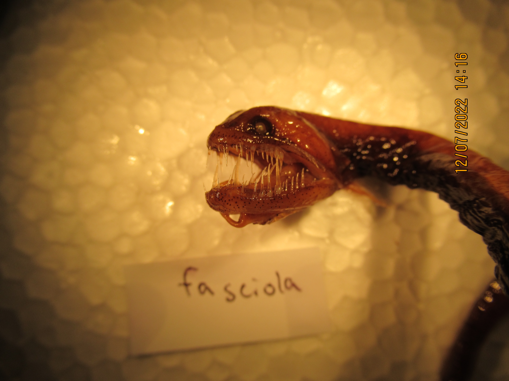
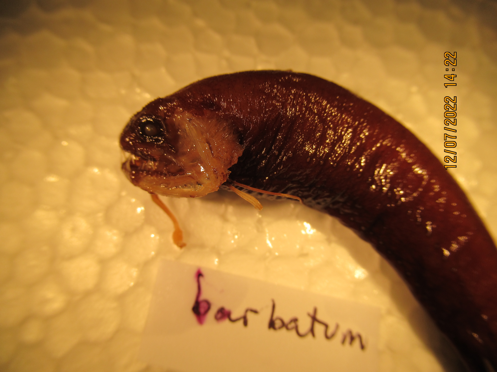

```{r setup, include=FALSE}
knitr::opts_chunk$set(echo = TRUE)
```

```{r, packages, include=FALSE}
library(tidyverse)
library(Momocs)
library(knitr)
library(vroom)
library(ape)
library(phytools)
library(wesanderson)
library(RRphylo)
library(ggtree)
library(ggfortify)
```

# Introduction

Stomiidae is a family of deep-sea ray-finned fish and one of the oldest living species on earth.
One of the most unique features of these fish are their skulls as its shape and specific features tend to vary from species to species.
As such, our research here sought to look into how the head shape of this family has evolved over time.
Previous research that has been done into the family of Stomiidae is relatively limited.
However, one such study done by @sutton1996species had a focus on uniquely preserved as well as novel features such as the pectoral girdle and vertebral column.
In the findings, it was suggested that by the nature of the larger prey Stomiidae target, these anatomical skull features have proven to be beneficial in physically allowing for the engulfing and consumption of their prey.
Another study performed by @kenaley2010comparative have found that other features that some stomiidae contain such as their cephalic photophore was the result of parallel evolution.
Similar studies performed by @fink1985phylogenetic performed a phylogenetic comparison study on the specific features of different stormiidae craniums, but it did not explore the if any significance of the rate of evolutionary change could be found that resulted in these diverse skull shapes.
As such, the goal of our study is to assess skull shape evolution across the Stomiidae, incorporating data from 18 different species in this family.
Data will be collected by characterizing the shape outline of the different specimens to answer the following 3 questions:

1.  What is the evolutionary rate for skull shape?
2.  Is there a significant evolutionary change of skull shape?
3.  Does the evolvability of the skull shape vary significantly among our major recorded lineages of Stomiidae?

# Methods

Images of various species of Dragonfish were digitized using FIJI.

Next, a Procrustes transformation was performed in order to translate, rotate, and scale the outlines for better analysis of their shape without factoring in arbitrary skull size.

Elliptical Fourier Analysis (EFA) was performed in order to describe wing shapes.
Principle Component Analysis (PCA) was then performed in order to minimize the number of variables explaining the variance in the data set.
The functions for these analyses are included in the R package "Momocs." PCA data was visualized to determine the distribution of morphoshape of the wings of the different species as well as the amount of variance described by different variables.
To prepare the comparative analysis on the PCA data, the phylogenetic tree was loaded positioned upper left.
The file names of each species were also identified using the identifier data provided by Prof. Kenaley.

The PC data was added to the identified species data accordingly.
The phylogeny tree was modified to only include the species that were identified and had a PCA data.
From here, the dragonfish skull PC data was separated in different variable under the Brownian Motion.

To determine the evolutionary rate, "RRphylo" package was used to determine the rate of evolution based on skull shape and from there, any statistically significant shift in shape evolution based on the Dragon fish clades were identified.

The rate of the significant evolutionary shift was identified along with the name of clades.

The phylogenetic independent contrast was performed on the PC datas to separate the original tip data independent of each other.

The PC values of skulls were then compared via linear model and analyzed to see if statistically significant value existed.

# Results

## Shape Analysis

::: {style="text-align: left"}
After visualizing the skull data of the dragonfish species, the skulls were scaled so that the data was adjusted for their difference in size.
This allowed for the contrast of skull shape only.
:::

<center>

```{r, echo=FALSE}

f <- list.files("CSV Files",pattern=".txt|.csv",full.names = TRUE)
out <- read_delim(f[1],delim="\t") %>% 
  as.matrix()
#transform matrix in momocs outline
out %>% 
  list() %>% 
  Out() %>% 
  coo_flipx() %>% 
  stack()
```

***Figure 1. Visualization of Dragonfish Skull Shape using EFA***

::: {style="text-align: left"}
Figure 1 depicts the general trigonal shape of the Dragonfish skull tracing from the premaxilla to the lower eye, upper eye, parietal, to the preopercular.
:::

```{r, echo=FALSE}
#make a large df with vroom
out.df <- vroom::vroom(f, id = "filename")
#add species info
out.df <- out.df %>% 
  mutate(specie=gsub("\\..+","\\1",basename(filename))) %>% 
  na.omit()
#make list
outs.l <- sapply(f,function(x) out.df %>% filter(filename==x) %>% select(X,Y) %>% as.matrix)
#extract species info
species <- gsub("\\..+","\\1",basename(names(outs.l)))
outs <-  outs.l %>% 
  Out(fac=list(specie=species)) %>% 
  coo_flipx() #visualize both wings uncorrected for size
```

```{r}
```

```{r}
```

<center>

```{r, echo=FALSE, results='hide'}

#Procrustes, align
skull.min <- outs %>% 
  coo_nb() %>% 
  min()
outs %>%
  coo_interpolate(skull.min) %>% 
  fgProcrustes() %>% 
  stack() #visualize forewings
```

***Figure 2. Visualization of Dragonfish Skulls using EFA after the size of the skull have been equalized***

<center>

```{r, include=FALSE, results='hide'}
outs %>%
  coo_interpolate(skull.min) %>% 
   coo_align()  %>%
  fgProcrustes() %>% 
  efourier(norm=FALSE) 
```

::: {style="text-align: left"}
Figure 2 depicts the visualized skulls processed through PCA.
This method allowed us to see the distribution of skull shapes.
The skulls showed minor changes in the horizontal and vertical planes, maintaining the trigonal shape.
:::

<center>

```{r, echo=FALSE, results='hide'}
skull.pca <- outs %>%
  coo_interpolate(skull.min) %>%
   coo_align()  %>%
  coo_slide(id=1) %>% 
  fgProcrustes() %>% 
  efourier(norm=FALSE) %>% 
  PCA()

skull.pca %>% 
  plot_PCA(title = "Dragonfish Skulls") 

```

***Figure 3. PCA analysis of Dragonfish Skulls***

::: {style="text-align: left"}
Figure 3 illustrates the trend in size of head shape in Stomiidae.
The increase in size has allowed for advantages in seeking and engulfing prey.
With this increased size, aerodynamics have decreased.
The smaller heads prioritize elusivity and speed.
:::

## Comparative Analysis

::: {style="text-align: left"}
After acquiring the PCA data, the phylogenetic tree of stomidoptera was filtered to only include the species that were included in this study.
:::

<center>

```{r, fig.show='hide', display=FALSE}

stom.tree <- ape::read.tree("Stomiidae.tre")
plot(stom.tree,cex=0.1)
```

```{r, echo=FALSE, results='hide'}
stom.tree <- ladderize(stom.tree)
plot(stom.tree,cex=0.1)

stom.tree$tip.label <- gsub("_"," ",stom.tree$tip.label)
basename(names(outs))[1:5]
stom.tree$tip.label

#
out.data <- tibble(xy.file=basename(names(outs))) %>% 
  mutate(species=gsub(".txt","",xy.file))

skull.pca2 <-  tibble(xy.file=basename(rownames(skull.pca$x)),PC1=skull.pca$x[,1],PC2=skull.pca$x[,2]) %>% 
  left_join(out.data)

```

***Figure 4. Phylogenetic Tree of Stomiidae***

::: {style="text-align: left"}
Figure 4 depicts the vast array of species present under the Stomiidae family.
:::

## Evolutionary Rates

<center>

```{r,echo=FALSE}
drops <- stom.tree$tip.label[!stom.tree$tip.label%in%unique(out.data$species)]

stom.tree2 <- drop.tip(stom.tree,drops)


#PC1
skull.pc1 <- skull.pca2 %>% 
    filter(species%in% stom.tree2$tip.label) %>% 
  group_by(species) %>% 
  summarize(PC1=mean(PC1)) %>% 
  pull

names(skull.pc1) <-  skull.pca2%>% 
    filter(species%in% stom.tree2$tip.label) %>% 
  group_by(species) %>% 
  summarize(PC1=mean(PC1)) %>% 
  pull(species)

#PC2s
skull.pc2 <- skull.pca2 %>% 
    filter(species%in% stom.tree2$tip.label) %>% 
  group_by(species) %>% 
  summarize(PC2=mean(PC2)) %>% 
  pull(PC2)

names(skull.pc2) <-  skull.pca2%>% 
    filter(species%in% stom.tree2$tip.label) %>% 
  group_by(species) %>%
  summarize(PC2=mean(PC2)) %>% 
  pull(species)

plot(stom.tree2,cex=0.5)
```

***Figure 5. Adjusted phylogenetic tree of stomiidae included in the study***

::: {style="text-align: left"}
Figure 5 depicts the correct species that were analyzed in this study spanning from the most distant relatives, Chauliodus sloani and Malacosteus niger.
With this information we can track the differentiated skulls among the seperation and evolution of the species.
:::

```{r, include=T}

skullPC1.BM<-brownie.lite(stom.tree2,skull.pc1*100)
skullPC2.BM<-brownie.lite(stom.tree2,skull.pc2*100)

#Evolutionary rates of dragonfish skull
skullPC1.BM$sig2.single
skullPC2.BM$sig2.single
```

::: {style="text-align: left"}
In the chart above, evolutionary rates between PC1 and PC2 are compared.
The evolutionary rate of PC1 is almost double the rate of PC2.
PC1 is .07253884, evolving at a much faster rate than the latter, .04402073.
One might see smaller yet more frequent changes in skull shape in PC1.
:::

## Shifts in Evolutionary Rates

::: {style="text-align: left"}
The evolutionary shift was then measured to determine if any significant shift in evolutionary rate was present according to the different clades of stomiidae under the Brownian model.
:::

<center>

```{r,include = T}
skullPC1.RR <- RRphylo(tree=stom.tree2,y=skull.pc2)
skullPC1.SS<- search.shift(RR=skullPC1.RR,status.type="clade")

skullPC1.SS$single.clades
```

```{r, include = F}
plot(stom.tree2)
nodelabels(node = as.numeric(rownames(skullPC1.SS$single.clades)),text = rownames(skullPC1.SS$single.clades))
```

::: {style="text-align: left"}
The rate difference of PC1 and PC2 is .000452565.
Since the p-value is 1, the evolutionary rates between the two components is not significant, but this can be due to lack of more data.
:::

```{r,include = T}
skullPC1.plot <- plotShift(RR=skullPC1.RR,SS=skullPC1.SS)
skullPC1.plot$plotClades()
```

***Figure 8. Significant evolutionary rate found in the Stomiidae phylogeny***

::: {style="text-align: left"}
Figure 8 portrays the shift in evolutionary rates among clades in the phylogentic tree.
The blue circle in the graph above depicts a sharp increase in evolutionary rate in clade 13 when the overall trend is a slight decrease.
This contrast is quite significant showing a fast evolution between the two species Flagellostomias boureei and Thysanactic dentex.
:::

## Shape Evolution Correlation

::: {style="text-align: left"}
The PC1 and PC2 data that underwent phylogenetic independent contrast showed that the PC1 data of skull shape comparison had much more significant correlation compared to the PC2.
:::

# Discussion

Following the studies that have been done on the phylogenetic impact on the cerebral features of the Stormiidae, this study aimed to study the correlation between evolutionary rate and the skull shape.
Our study showed that using the PC1 model under the Brownian motion showed the evolutionary rate of 0.0725% compared to the PC2 model which showed evolutionary rate of 0.0440%.These results indicated that PC1 was the better model to indicate the relationshp between the the skull shape and the Stormiidae phylogeny.
As seen iun Figure 8, the significant shift in the evolutionary rate occured at the clade containing the Flagellostomias Boureei and Thysanactis Dentex.
Although its specific clade could not be identified through the isolated tree as we lacked the taxonomic information of Stormiidae, another study done by @kenaley2014complex have identified both Flagellostomias Boureei and Thysanactis Dentex to be part of the Melanostomiinae sub-family.
The length of the tree for clade 13 that diverges to Flagellostomias Boureei and Thysanactis Dentex is longer than the rest indicating more evolutionary changes. This makes us believe that these two species must have had to develop changes quite rapidly to be able to survive. The fitness of this species depended upon their smaller jaws and agility to catch their pray. Smaller yet quicker changes evolved. On the other side of the node, developing slower are the larger jawed fish. These changes in the jaw and head shape were much more drastic, taking a longer time to develop. These larger jaws, as shown in the photos below of species such as the Idiacanthus Fasciola, developed to be more suitable for catching larger prey. 
To further improve our study more diverse species of stromiidae could have been examined and if the taxonomic data was avaialble we would be able to get a more accurate conclusion of where the signfiicant shift in the evolutionary rate in reference to skull shape occured.

 \

<center>

{width="50%"}

 \

<center>

{width="50%"}

 \

<center>

{width="50%"}

 \

<center>

{width="50%"}

 \

<center>

{width="50%"}

 

# Author Contributions

Justin - File Formatting, Code, Methods, Discussion, Results

James - Intro, Methods, Discussion, Image Analysis, Bibliography

Chris - Bibliography, Introduction, Image analysis

John - Results, Discussion, Editing, Bibliography 

## CPK Comments

Excellent work!!! You leveraged a lot that you learned in the course to ask a really interesting question. The analysis is clear and concise and the the figures at a ton to the report and answering the question. I also really like how well you tracked down important papers on the Stomiidae. Congrats on putting it all together.

150/150

# References
